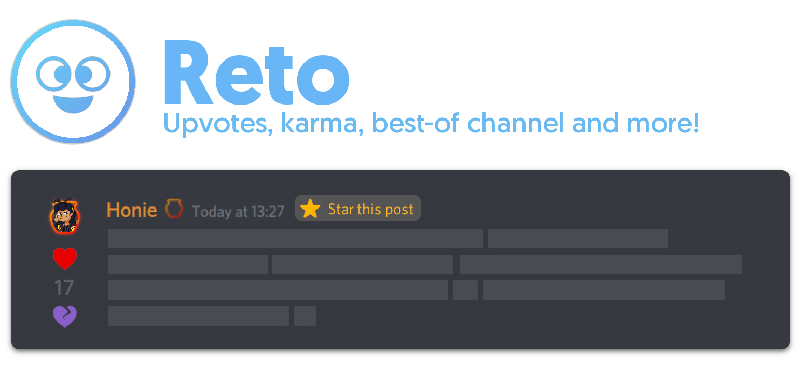

## ❌ End-of-Life

Reto Legacy's codebase has been discontinued on **April 6th, 2023**, after entering LTS in **March 1st, 2022**. The current open-source code is given as-is, without any planned updates or bug-fixes. Thank you so much for supporting Reto over the years!

The current version of Reto Legacy (1.8) is currently being hosted on [Discord](https://discord.com/oauth2/authorize?client_id=591466921812164608&permissions=1342524496&scope=bot) until its successor, Retool (closed-source, at the moment), has finished development - keep in mind the current version may encounter performance issues due to the amount of servers it has to keep going at a time.

If you have any problems with Reto Legacy, consider joining the [Support Server](https://discord.gg/RAwfrty).

***

## 🤖 Reto
> Reto is a community-oriented Discord bot, featuring a karma system, a way to reward the best comments, leaderboards, and so much more! React to a post with the `plus` or `minus` emojis to give said user some points for their content. `Curators` can even star (react with the exclusive `10` emoji) posts to give them extra points, and add their comment to a special "Best Of" channel for all to admire!

## ⚙️ Features
`The bot's default prefix is "?".`
- Look at your own (or others') karma by checking your **?profile**.
- Duke it out and see who has the most points on the **?leaderboard**. `?globalleaderboard`
- Or maybe check the best-rated comments on the **?postleaderboard**!  `?globalpostleaderboard`
- Change how the reaction emojis look with **?emoji edit**.
- Set up _Reddit-like_ automatic reactions in any channel using **?autovote**.
- These are just the main ones - check out the entire command list with **?help**!

## 🙋 Any questions?
Check the [FAQ](https://github.com/honiemun/reto-legacy/wiki/Frequently-Asked-Questions) and see if that clear things up! If not, you can always come say hi at our [support server](https://discord.gg/rrszpTN).

## 👨‍💻 Self-hosting Reto
Want to host Reto on your own machine? [Read this guide](https://github.com/honiemun/reto-legacy/wiki/Self-hosting-Reto) on how to do exactly that!
